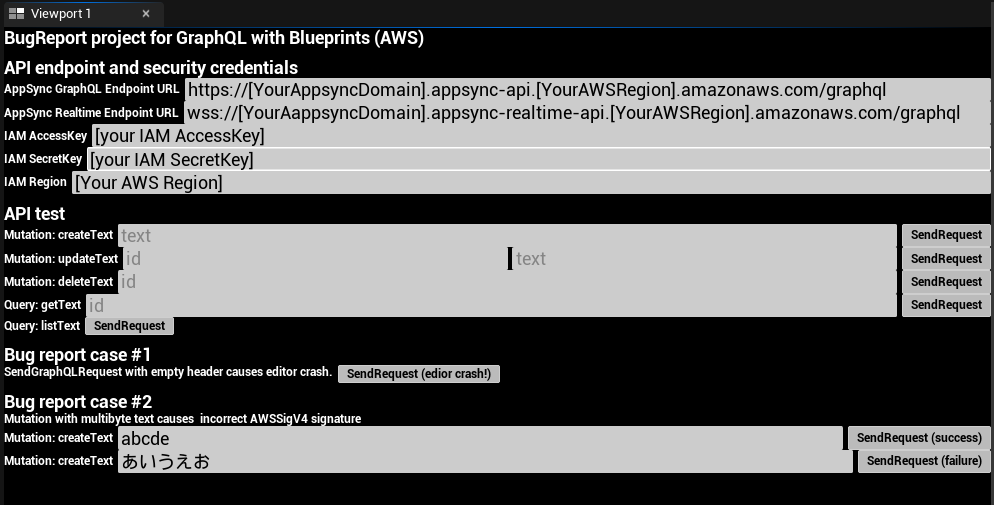

# BugReport project for GraphQL with Blueprint (AWS)

This project is the example project to reproduce bug reports for GraphQL with Blueprints(AWS) plugin of UnrealEngine 5.1.

## Usage

- Deploy AppSync API on your AWS account with [github.com/tomotaco/terraform-appsync-iamauth-sample](https://github.com/tomotaco/terraform-appsync-iamauth-sample)
- Copy your GraphQL with Blueprints(AWS) plugin below `Plugins` folder.
- Double click at `GraphQLBPBugReport.uproject` and launch UE5.1.
- Press `Play in Editor`.
- Input `AppSync GraphQL Endpoint URL`, `AppSync Realtime Endpoint URL`, `IAM AccessKey`, `IAM SecretKey` and `AWS Region`.
- Read `Bug report case #1` and press `SendRequest (editor crash!)`
- Read `Bug report case #2` and press `SendRequest (success)` and `SendRequest (failure)`.

